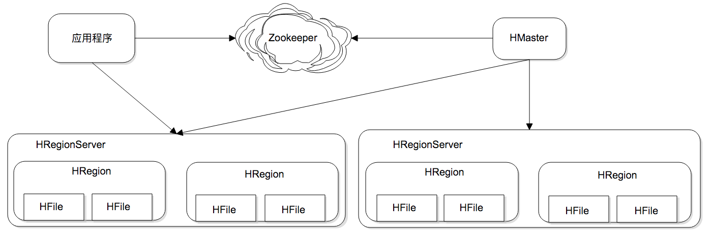
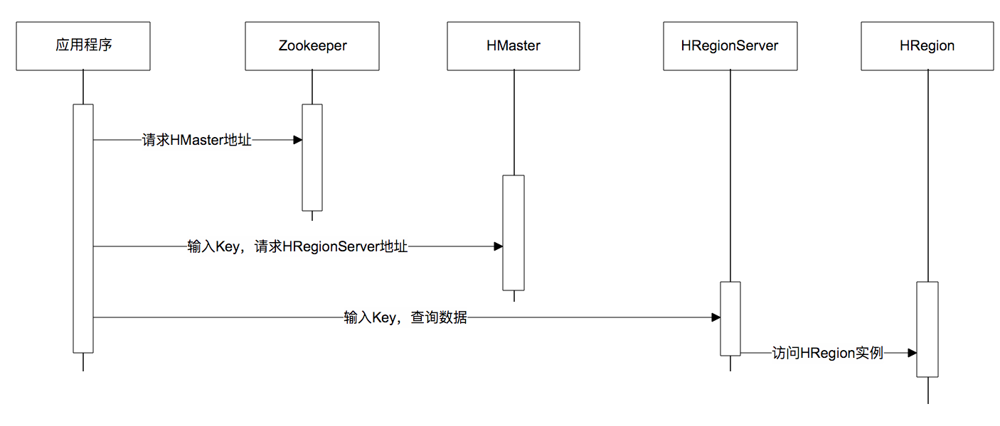

# HBase

## HBase架构

## 调用时序图

## LSM树

传统的机械式磁盘的访问特性是**连续读写很快，随机读写很慢**。这是因为机械磁盘靠电机驱动访问磁盘上的数据，电机要将磁头落到数据所在的磁道上，这个过程需要较长的寻址时间。如果数据不连续存储，磁头就要不停的移动，浪费了大量的时间。

为了提高数据写入速度，HBase 使用了一种叫作**LSM 树**的数据结构进行数据存储。LSM 树的全名是 Log Structed Merge Tree。翻译过来就是 Log 结构合并树。数据写入的时候以 Log 方式连续写入，然后异步对磁盘上的多个 LSM 树进行合并。

